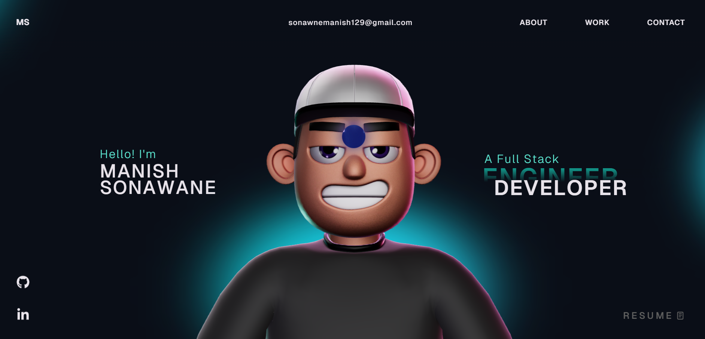

# Manish Sonawane - Portfolio Website 🚀

This repository contains my personal portfolio website, featuring a full-stack developer profile with interactive 3D elements.

## Instructions 🛠️

I have modified the gsap club plugins with the trial plugins, but with the trial plugin you cannot host it🔴. So for Club plugins, Check out here: https://gsap.com/docs/v3/Installation/

**Techstack** - React, TypeScript, GSAP, ThreeJS, WebGL, HTML, Css, JavaScript

## License

This project is open source and available under the [MIT License](LICENSE).
